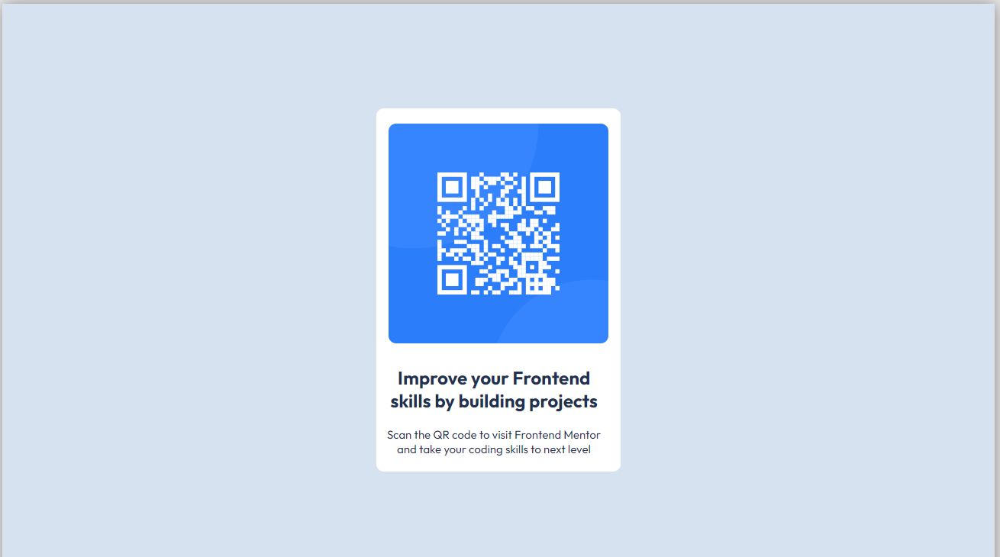

# Frontend Mentor - QR code component solution
# warm-up-project
This project is a collaborative learning experience among four mentees and their mentor(me)

## Table of contents

- [Overview](#overview)
  - [Screenshot](#screenshot)
  - [Links](#links)
- [My process](#my-process)
  - [Built with](#built-with)
  - [What I learned](#what-i-learned)
  - [Continued development](#continued-development)
  - [Useful resources](#useful-resources)
- [Author](#author)
- [Acknowledgments](#acknowledgments)

**Note: Delete this note and update the table of contents based on what sections you keep.**

## Overview

### Screenshot

### Links

- Solution URL: [SOLUTION ON GITHUB](https://github.com/cindykandie/warm-up-project/)
- Live Site URL: [LIVE SITE](https://cindykandie.github.io/warm-up-project/)

## My process

### Built with

- Semantic HTML5 markup
- CSS custom properties
- Flexbox
- Mobile-first workflow

### What I learned
I learnt how to create multiple background and balancing the ratios so its responsive

### Future features

Would like to have a qr code site like this that leads to my personal website

## Author

- Website - [cindykandie](https://cindykandie.xyz)
- Frontend Mentor - [@cindykandie](https://www.frontendmentor.io/profile/cindykandie)
- Twitter - [@cindykandie](https://www.twitter.com/cindykandie)

## Acknowledgments

This is where you can give a hat tip to anyone who helped you out on this project. Perhaps you worked in a team or got some inspiration from someone else's solution. This is the perfect place to give them some credit.

